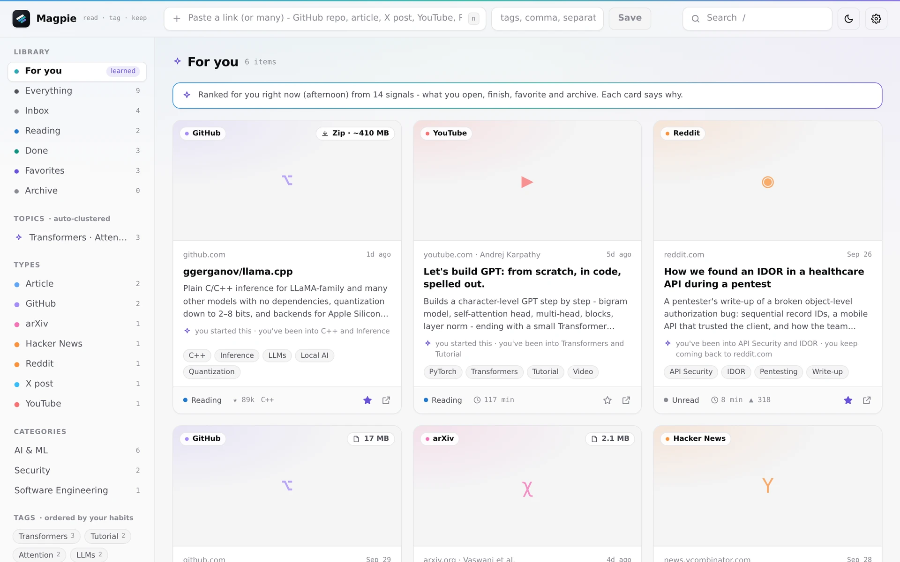
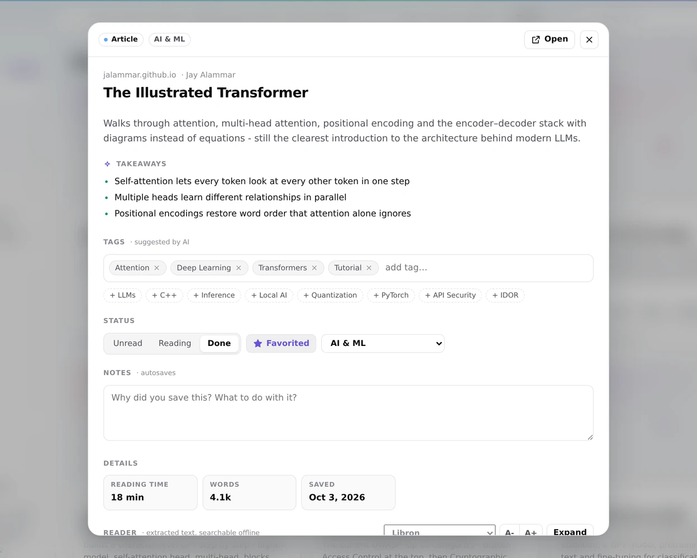
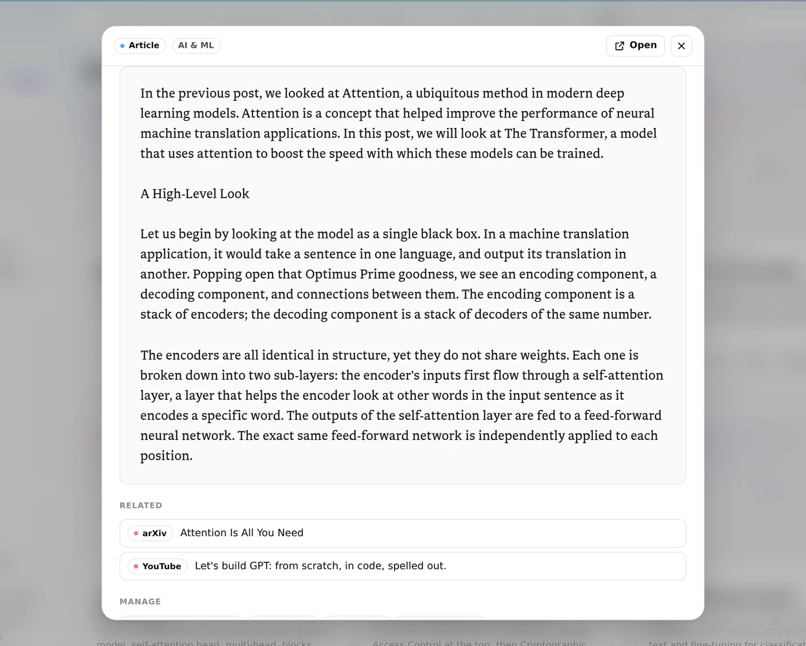
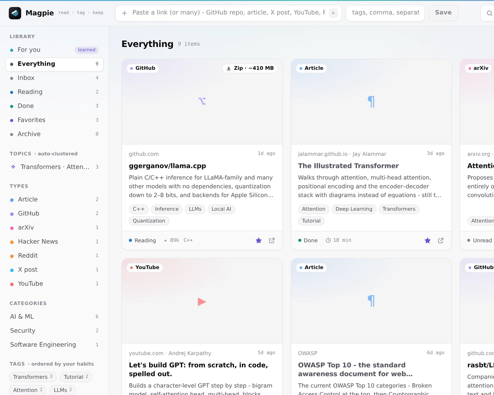
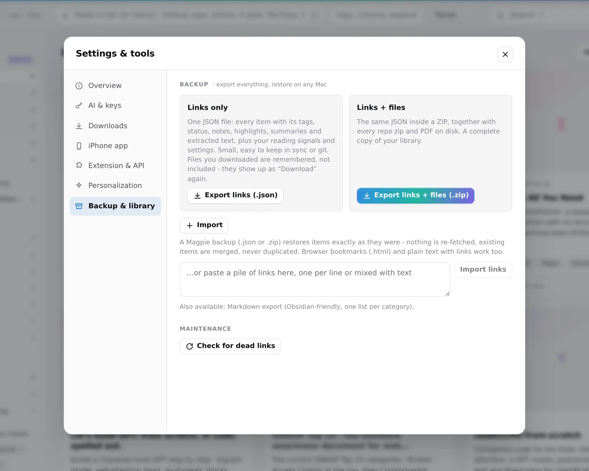

  

<h1 align="center">Magpie</h1>

  <strong>A self-organizing, read-it-later knowledge base.</strong> 
  Save a link and Magpie works out what it is, tags it, summarizes it and keeps it, so you can actually find it again.

  

Apple silicon · signed and notarized · iOS, Android and Windows coming soon

<picture>
  <source media="(prefers-color-scheme: dark)" srcset="images/for-you-dark.webp">
  
</picture>

## What it does

- **Saves anything worth keeping.** GitHub repos, articles, X posts, YouTube videos, arXiv papers, PDFs, Reddit and Hacker News threads. Paste one link or a whole pile of them at once.
- **Organizes itself.** Every save gets a type, a category, tags, a short summary and key takeaways, written by Claude with your Anthropic API key, or by a built-in tagger without one.
- **Learns what you read.** The *For you* view ranks your unread items by what you actually open, finish and favorite, and every card says why it is there.
- **Reads offline.** The extracted text stays readable and searchable after the original page disappears, in Libron or four other reading fonts.
- **Keeps the files.** Repo zips and PDFs are downloaded automatically under a size limit you choose, only when you ask, or not at all.
- **Stays yours.** Your library lives on your Mac, private to your user account. Export it as links only or links plus files and restore it any time.

<table>
  <tr>
    <td width="50%" valign="top">
      <picture>
        <source media="(prefers-color-scheme: dark)" srcset="images/reader-dark.webp">
        
      </picture>
      
<strong>Focused reading card.</strong> Summary, takeaways, tags, status and notes in one place, the rest of the library blurred away.

    </td>
    <td width="50%" valign="top">
      <picture>
        <source media="(prefers-color-scheme: dark)" srcset="images/reading-dark.webp">
        
      </picture>
      
<strong>A reader that works offline.</strong> Clean extracted text in Libron, Literata, Source Serif 4 or Atkinson Hyperlegible, at the size you like.

    </td>
  </tr>
  <tr>
    <td width="50%" valign="top">
      <picture>
        <source media="(prefers-color-scheme: dark)" srcset="images/library-dark.webp">
        
      </picture>
      
<strong>Sorted for you.</strong> Browse by type, auto-clustered topic, category or tag, or search everything you have saved.

    </td>
    <td width="50%" valign="top">
      <picture>
        <source media="(prefers-color-scheme: dark)" srcset="images/settings-dark.webp">
        
      </picture>
      
<strong>Everything in one place.</strong> AI keys, downloads, backup and restore, all in one tidy settings window.

    </td>
  </tr>
</table>

## Install

1. Download the latest `.dmg` from [Releases](https://github.com/0xVulcan/Magpie/releases/latest).
2. Open it and drag **Magpie** to **Applications**.
3. Launch Magpie from Applications or Launchpad. There is nothing else to install or start.

Optional: for AI tags and summaries, paste an Anthropic API key in **Settings → AI & keys**. Your library is kept in `~/Library/Application Support/Magpie`, so updating or reinstalling the app never touches it.

## Coming soon

iOS, Android and Windows releases are coming after testing.
